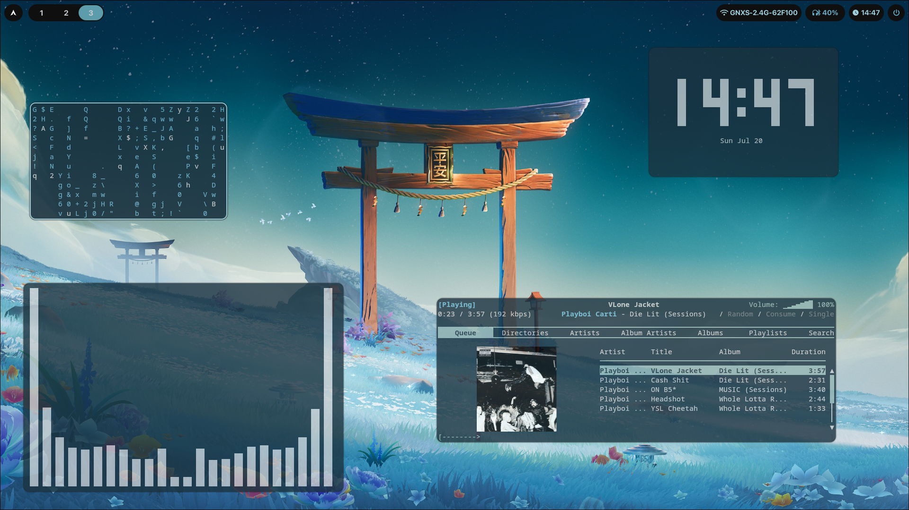

# my dotfiles 🍃
my dotfiles can be downloaded here. 
last updated on: **20th July, 2025.**


### Tested on:  Arch Linux
> This was made in Arch Linux, but it will most likely work for other distros too. All you need to do really is to build/install the dependencies.

### 📓 Changelog
> [Click me!](changes.md)

### ⏺ Pre-installation steps (Read)

‼️ **If you have already configured your own dotfiles, please back them up before you install as those will be lost. You can move them to GitHub, or just make a backup locally, it's up to you.**

**Dependencies**:
```
hyprland, waybar, playerctl, rofi-lbonn-wayland, swww, dunst, wlogout, grim, slurp, alacritty, python, pywal16 (or regular pywal), firefox, thunar, bluez, bluez-utils, networkmanager, network-manager-applet, blueman, wl-clipboard, wtype, rofi-emoji, yt-dlp, hyprlock, waypaper, pywalfox, mpv, pamac, hyprpicker
```


### ⬇️  Installation


1. Clone this repository to your disk.

```
git clone https://github.com/alluxd/dotfiles.git ~/path-to-here
``` 
(replace path-to-here with wherever you want to clone, or just leave it as "~/")

2. Open a terminal, and type:
```
cd ~/path-where-you-cloned-the-repo/config
cp -r * ~/.config/
```
3. Now type (without closing the previous terminal):
```
cd ..
cd scripts
cp * ~/.local/bin
```

4. Log out of Hyprland (or reboot)
5. That's it!

<br>
<br>

## 🔑  Hotkeys: [here](hotkeys.md)
